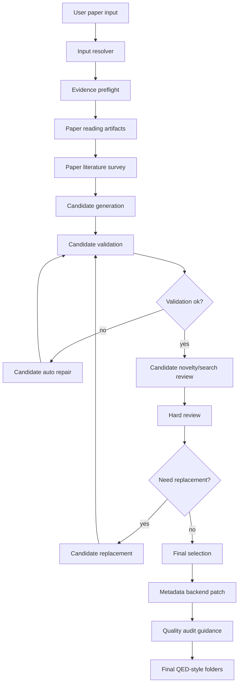

# QAgent Architecture

QAgent is organized as a staged pipeline. Each stage writes local artifacts under `outputs/{batch_id}/`.



## Stage Details

### 1. Input Resolver

Parses flexible markdown input into paper entries. It tries to identify title, authors, URL, DOI, PDF URL, CVGMT ID, arXiv ID, and local PDF paths.

### 2. Evidence Preflight

Attempts to fetch metadata, PDF, and full text. arXiv/CVGMT/direct PDF/local PDF sources are preferred. If full text is incomplete, the paper is marked lower confidence.

### 3. Paper Reading Artifacts

Creates paper-level evidence files such as:

- `paper_profile.json`
- `theorem_cards.json`
- `proof_cards.json`
- `method_cards.json`
- `limitation_cards.json`
- `gap_cards.json`
- `paper_reading_quality.json`

### 4. Paper Literature Survey

Searches for related work and known nearby directions when possible. The survey is used as a negative map before candidate generation.

### 5. Candidate Generation

Codex CLI generates `(a + 1) * b` candidates per paper.

General style candidates emphasize:

- theorem skeletons;
- proof pressure points;
- method modules;
- adjacent-model transfer;
- direct-corollary attacks;
- research-direction gates.

Specialized style candidates emphasize curated transfer patterns.

### 6. Candidate Validation

Local validators check:

- required fields;
- candidate count;
- theorem-form statement;
- direct-corollary attack structure;
- research-direction gate;
- transfer-map references;
- ranked/candidate ID consistency.

Validation errors trigger candidate repair. Quality warnings are written into candidate quality flags.

### 7. Hard Review

Hard review checks the top candidates against novelty and direct-corollary risks. It writes:

- `hard_review.json`
- `hard_review_passed_candidates.json`
- candidate survey and critic traces

### 8. Candidate Replacement

When too few candidates survive strict review, QAgent may ask Codex to replace weak candidates. Replacement is transactional: if replacement validation fails, QAgent restores the previous valid candidate-stage files and continues from the last usable state.

### 9. Final Selection

Final selection only uses hard-review-allowlisted candidates. It prefers strict candidates but may export weaker allowlisted candidates with `low_confidence_final=true` and risk disclosures instead of failing the whole run.

Final selected questions are written under:

```text
outputs/{batch_id}/{paper_id}/selected/{question_id}/
```

### 10. Quality Audit

The audit writes guidance into final question files. Content-quality issues are surfaced as guidance rather than silently hiding generated results.

## Important Design Principle

QAgent is intentionally stricter before final selection and softer after final selection:

- candidate generation and validation should reject weak, vague, direct-corollary, or template-like candidates;
- final selection should not fail the whole run for a merely imperfect but allowlisted candidate;
- final outputs should clearly disclose low-confidence risks.
